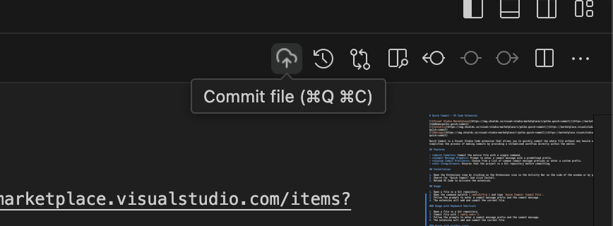

# Quick Commit - VS Code Extension

Quick Commit is a Visual Studio Code extension that allows you to quickly commit the whole file without any hassle or extra clicks. This extension simplifies the process of making commits by providing a streamlined workflow directly within the editor.

## Features

- **Quick Commit**: Commit the entire file with a single command.
- **Commit Message Prompt**: Prompt to enter a commit message with a predefined prefix.
- **Custom Commit Prefixes**: Choose from a list of common commit message prefixes or enter a custom prefix.
- **Git Integration**: Ensures that the project is a Git repository before committing.

## Installation

1. Open the Extensions view by clicking on the Extensions icon in the Activity Bar on the side of the window or by pressing `Ctrl+Shift+X`.
2. Search for "Quick Commit" and click Install.
3. Reload VS Code to activate the extension.

## Usage

1. Open a file in a Git repository.
2. Open the command palette (`cmd+shift+p`) and type `Quick Commit: Commit File`.
3. Follow the prompts to enter a commit message prefix and the commit message.
4. The extension will add and commit the current file.

### Usage with Keyboard Shortcuts

1. Open a file in a Git repository.
2. Commit file with (`cmd+q cmd+c`).
3. Follow the prompts to enter a commit message prefix and the commit message.
4. The extension will add and commit the current file.

### Usage with toolbar icons

1. Open a file in a Git repository.
2. Click on the Quick Commit icon in the toolbar.
3. Follow the prompts to enter a commit message prefix and the commit message.
4. The extension will add and commit the current file.

## Requirements

- Visual Studio Code
- Git must be installed and available in your system PATH

## Extension Settings

This extension does not require any special settings.

## Known Limitations

- Does only support Git
- Does only support committing the whole file

## Release Notes

### 1.0.0

- Initial release of Quick Commit

## Meta Information

**Publisher**: Pulko

**Company Website**: [https://pulko-app.com](https://pulko-app.com)

**LinkedIn**: [https://linkedin.com/in/fedor-tkachenko](https://linkedin.com/in/fedor-tkachenko)

**Source Code Repository**: [https://github.com/Pulko/quick-commit](https://github.com/Pulko/quick-commit)
